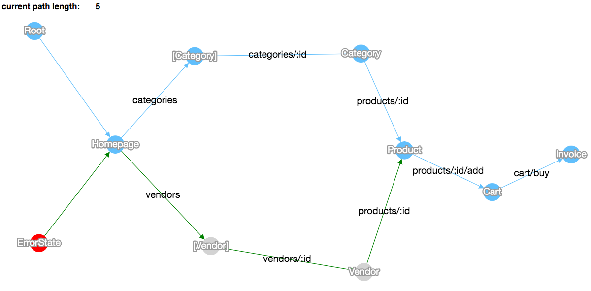

# choclety-hask

Generate graphs from [Servant](http://haskell-servant.readthedocs.io) API types.
Inspired by [choclety](https://github.com/mooreniemi/choclety).

[ See a live demo.](https://corajr.github.io/choclety-hask/index.html)

## Purpose

This library helps you render
your [Servant](http://haskell-servant.readthedocs.io) API as a state machine,
with representations as states and requests as state transitions. This could be
useful, for example, when looking for the shortest path(s) to reach a desired
state (such as a revenue-generating action).

## Prerequisites
- [haskell-stack](https://www.haskellstack.org/): `curl -sSL https://get.haskellstack.org/ | sh`
    - run `stack setup` to obtain the Haskell compiler

## Usage

The library exposes a function, `choclety`, that generates graph JSON suitable
for use with the included [viewer](https://corajr.github.io/choclety-hask/index.html).

To generate a graph for use with Cytoscape.js:

`stack build && stack exec choclety`

To view the graph, serve up the local directory, e.g. by `python -m SimpleHTTPServer 8090`, and view [127.0.0.1:8090](http://127.0.0.1:8090).

To serve up the example API on port 8080:

`stack exec choclety-server`

To run the test suite:

`stack test`
