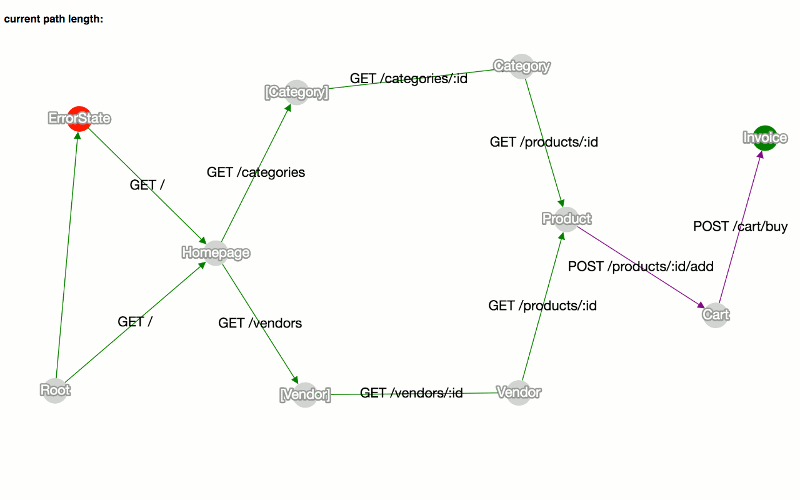

# servant-state-graph

Generate graphs from [Servant](http://haskell-servant.readthedocs.io) API types.
Inspired by [choclety](https://github.com/mooreniemi/choclety).

[See a live demo.](https://corajr.github.io/servant-state-graph/index.html)

## Purpose

This library helps you render
your [Servant](http://haskell-servant.readthedocs.io) API as a state machine,
with representations as states and requests as state transitions. This could be
useful, for example, when looking for the shortest path(s) to reach a desired
state (such as a revenue-generating action).

It also includes the beginnings of
a [HAL](http://stateless.co/hal_specification.html) library for Servant, for
serving a hypermedia API.

## Prerequisites
- [haskell-stack](https://www.haskellstack.org/): `curl -sSL https://get.haskellstack.org/ | sh`
    - run `stack setup` to obtain the Haskell compiler

## Docs

See the [Haddock documentation][haddock].

## Usage

The library exposes a function `stateGraph` that can generate graph JSON
suitable for use with the included [viewer][viewer] or serve the viewer on a
desired port.

To serve up the graph viewer (uses Cytoscape.js)
at [127.0.0.1:8090](http://127.0.0.1:8090) for a sample API:

`stack build && stack exec state-graph`

To serve up the sample API itself on port 8080:

`stack exec state-graph-server`

Or, to serve up the HAL-supporting version of the API:

`stack exec state-graph-server -- --hyper`

To run the test suite:

`stack test`

[viewer]: https://corajr.github.io/servant-state-graph/viewer.html
[haddock]: https://corajr.github.io/servant-state-graph/index.html
